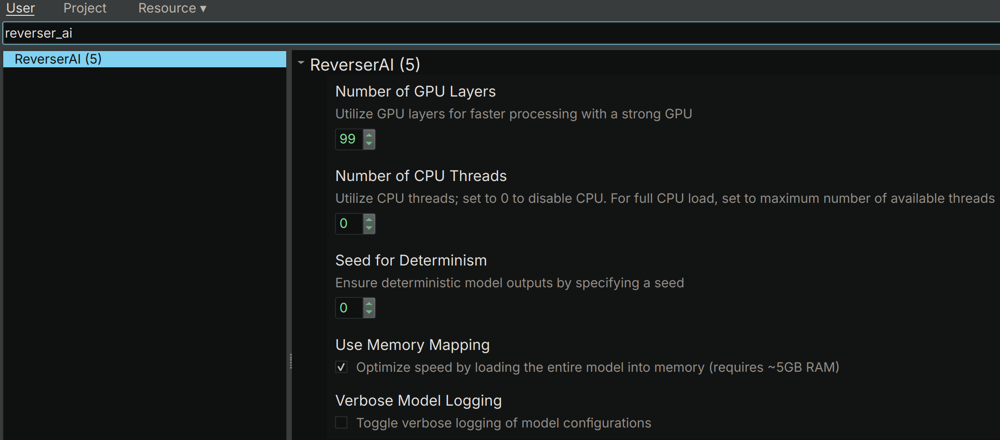

# ReverserAI (v1.0.1)
Author: **Tim Blazytko**

_Provides automated reverse engineering assistance through the use of local large language models (LLMs) on consumer hardware._

## Description:

_ReverserAI_ is a research project designed to automate and enhance reverse engineering tasks through the use of locally-hosted large language models (LLMs). Operating entirely offline, this initial release features the automatic suggestion of high-level, semantically meaningful function names derived from decompiler output. _ReverserAI_ is provided as a Binary Ninja plugin; however, its architecture is designed to be extended to other reverse engineering platforms such as IDA and Ghidra.

While local LLMs do not match the performance and capabilities of their cloud-based counterparts like ChatGPT4 and require substantial computing resources, they represent a significant step forward in balancing performance with confidentiality requirements.

_ReverserAI_ serves as an initial exploration into the potential of local LLMs as aids in reverse engineering on consumer-grade hardware. It showcases what is currently achievable and plans to be a playground for future developments in the realm of AI-assisted reverse engineering.

Some example use cases can be found in [examples](./examples).

> [!NOTE]
> Disclaimer: My expertise in machine learning and LLMs is limited. There may exist more efficient models or methods to achieve similar tasks with greater performance. This project represents a culmination of research into viable configurations, offering a stable foundation with acceptable performance. Feedback and contributions to improve _ReverserAI_ are highly encouraged.


## Core Features

- **Offline Operation**: Runs LLMs entirely on local CPU/GPU, ensuring data privacy and security.

- **Automatic Function Naming**: Automatically suggests semantically meaningful function names from decompiler output.

- **Binary Ninja Integration**: Seamlessly integrates as a plugin with Binary Ninja.

- **Modular Architecture**: Designed for easy extension to support other reverse engineering tools like IDA and Ghidra.

- **Consumer Hardware Compatibility**: Optimized to run on consumer-grade hardware, such as Apple silicon architectures.


## Installation

_ReverserAI_ can be easily integrated via Binary Ninja's plugin manager. Alternatively, for those preferring command line installation, execute in Binary Ninja's `plugins` folder:

```bash
git clone https://github.com/mrphrazer/reverser_ai.git
cd reverser_ai

# install requirements
pip3 install -r requirements.txt

# install ReverserAI
pip3 install .
```

Upon initial launch, the tool will automatically download the `mistral-7b-instruct-v0.2.Q4_K_M.gguf` large language model file (~5GB). The download time varies based on internet connection speed. To manually initiate the download, execute the [`model_download.py`](scripts/model_download.py) script.


## Hardware Requirements

For optimal LLM performance on consumer-grade hardware, a setup with multiple CPU threads or a powerful GPU is advised. _ReverserAI_ runs efficiently on systems with at least 16 GB of RAM and 12 CPU threads, with queries taking about 20 to 30 seconds. GPU optimizations, especially on Apple silicon devices, can reduce this to 2 to 5 seconds per query.


## Usage

_ReverserAI_ is accessible through Binary Ninja's user interface and via command line.

### User Interface

To invoke the plugin within Binary Ninja, navigate to `Plugins -> ReverserAI` and, for example, run "Rename All Functions":

<p align="left">

</p>

Depending on the total number of functions in the binary, this may take a while. The AI-assisted function name suggestions will appear in the Log window:

<p align="center">

</p>


### Configuration

Configuring _ReverserAI_ to match your hardware setup optimizes its performance. Key configuration parameters include CPU and GPU utilization preferences: For powerful GPUs, configure _ReverserAI_ to primarily use GPU, reducing CPU threads to minimize overhead. Without a strong GPU, increase CPU thread usage to maximize processing power. For systems with balanced resources, allocate tasks between CPU and GPU for efficient operation. Further details on these parameters follow:

* `use_mmap`: Enables loading the entire model into memory (~5GB) when set to `true`. Recommended for performance improvement.

* `n_threads`:  Specifies the number of CPU threads to utilize. Maximize CPU thread count to the number of available CPU threads for full utilization, or set to 0 to disable.

* `n_gpu_layers`: Determines GPU layer usage. Enter values up to 99 for powerful GPUs, or 0 to disable GPU processing.

* `seed`: A fixed seed ensures deterministic behavior for debugging (consistent output for identical inputs). Modify the seed for varied responses.

* `verbose`:  Enabling `verbose` mode provides detailed logs about the model and configuration settings.

The default configuration prioritizes GPU performance and minimizes verbose output.


#### Binary Ninja

To adjust settings in Binary Ninja, open `Settings` and search for `reverser_ai`. Changes require Binary Ninja to be restarted.

<p align="center">

</p>

Each change requires a restart of Binary Ninja.


#### Parameter Tuning

For detailed parameter adjustment, utilize the [`gpt_function_namer.py`](scripts/gpt_function_namer.py) script with a configuration file, starting with the provided [`example_config.toml`](example_config.toml):

```
$ time python3 scripts/gpt_function_namer.py example_config.toml
Suggested name: xor_two_numbers

real	0m1.550s
user	0m0.268s
sys	0m0.223s
```


## Code Organization

_ReverserAI_'s codebase maintains a clear separation between generic LLM functionalities and tool-specific integration, ensuring modularity and ease of extension. Below is an overview of the primary components:

- **`gpt` Folder**: Contains code for interacting with large language models (LLMs). This includes:
  - A generic agent (`agent.py`) for model-agnostic operations.
  - A specialized module (`function_name_gpt.py`) for generating function name suggestions.

- **`binary_ninja` Folder**: Hosts wrapper instances that:
  - Utilize Binary Ninja features to produce decompiler outputs.
  - Interface with the `gpt` folder's agents, enabling LLM-powered function naming within Binary Ninja.
  

## Limitations and Future Work

_ReverserAI_ serves as a proof of concept that demonstrates the potential of leveraging local LLMs for reverse engineering tasks on consumer-grade hardware. Currently, its primary functionality is to offer function name suggestions, but there exists significant scope for enhancement and expansion. Future directions could include:

* Investigating additional interaction methods and parameters with LLMs to enhance quality and processing speed.

* Adding network communication for hosting the _ReverserAI_ agent on a powerful server, circumventing local hardware constraints.

* Fine-tuning existing models or developing specialized models tailored to reverse engineering needs.

* Expanding functionality to include code explanations, analysis, and bug detection, subject to scalability and feasibility.

* Extending support to other reverse engineering platforms such as IDA and Ghidra.

This project welcomes further contributions, suggestions, and enhancements, including pull requests.


## Contact

For more information, contact [@mr_phrazer](https://twitter.com/mr_phrazer).
